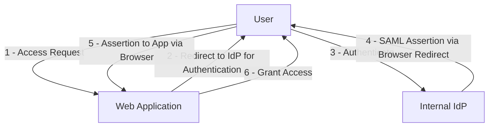
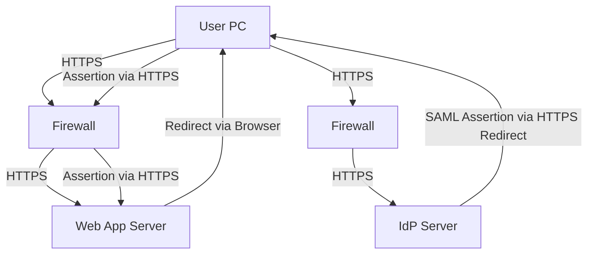
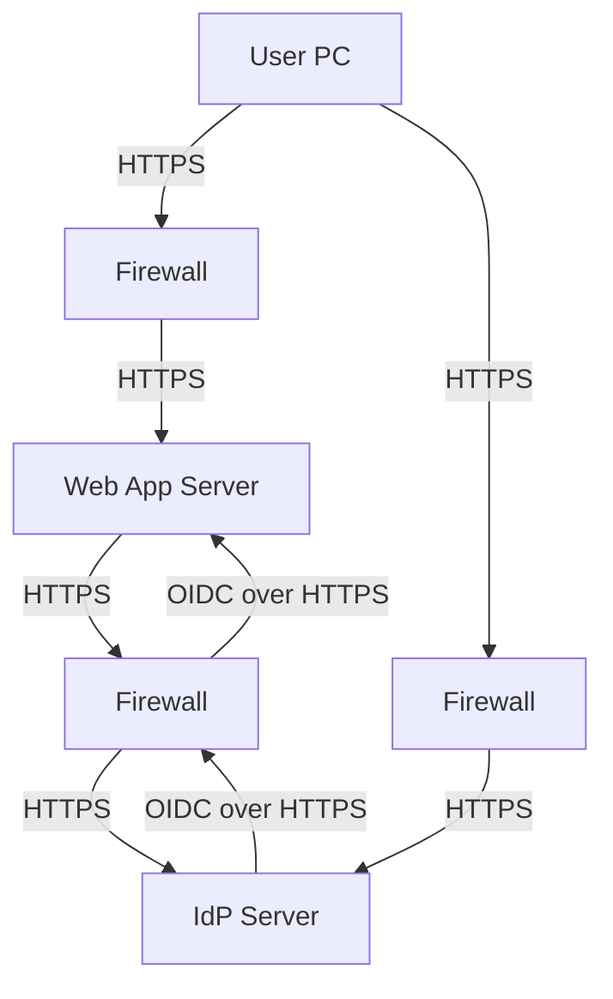
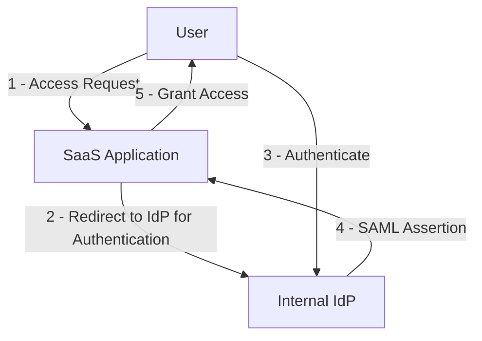
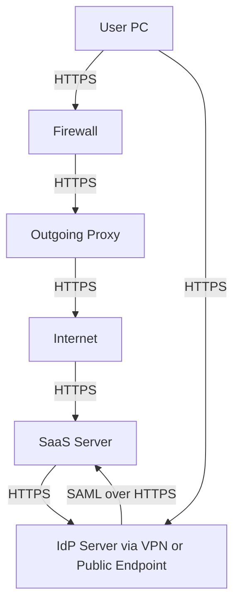
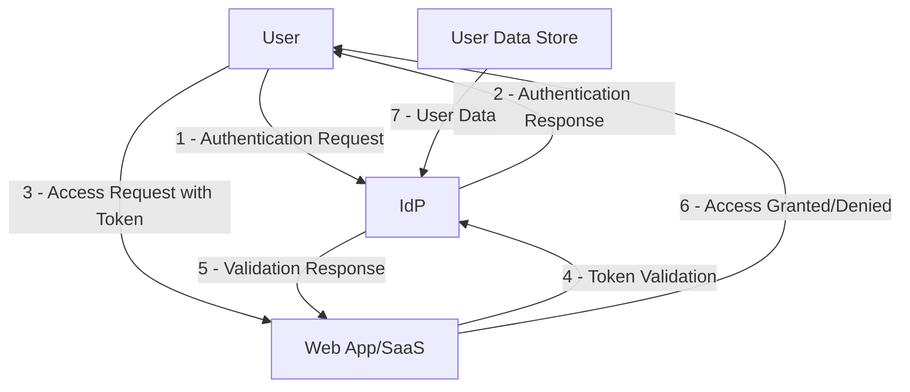

# SSO Pattern with IdP

## Purpose
The purpose of this document is to outline the Single Sign-On (SSO) pattern using an Identity Provider (IdP) to enable seamless authentication and authorization across multiple applications. This pattern aims to enhance user experience by reducing the need for multiple logins, improve security by centralizing authentication, and simplify administration of user access within an organization.

## Scope
This document covers the design and implementation of SSO for internal users accessing web applications within an internal network or Software as a Service (SaaS) applications on the Internet using an internal IdP. It includes specific patterns for authentication and authorization via Security Assertion Markup Language (SAML) and OpenID Connect (OIDC) protocols. The scope is limited to enterprise environments where an internal IdP is managed by the organization.

## Use Case
1. **Internal User SSO with SAML for Internal Web Application**: An internal user authenticates and authorizes access to a web application within the internal network using an internal IdP through SAML.
2. **Internal User SSO with OIDC for Internal Web Application**: An internal user authenticates and authorizes access to a web application within the internal network using an internal IdP through OIDC.
3. **Internal User SSO with SAML for Internet SaaS**: An internal user authenticates and authorizes access to a SaaS application on the Internet using an internal IdP through SAML.

## Patterns

### Pattern 1: Internal User SSO Authenticate and Authorize a Web Application within Internal Network Using Internal IdP through SAML
#### Logical Diagram

**Description**: The user attempts to access a web application, which redirects them to the internal IdP via the browser. After successful authentication, the IdP sends a SAML assertion back through the user's browser, which is then forwarded to the application via a browser redirect. The application then grants access to the user.

#### Physical Diagram

**Description**: The user's PC communicates through a firewall to reach the web application server within the trusted internal zone, which redirects the browser back to the user to access the IdP server through another firewall for authentication due to micro-segmentation. After authentication, the IdP sends the SAML assertion back through the user's browser via HTTPS redirect, which is then forwarded to the web application server through the firewall. Firewalls exist between the user and web application, and between the user and IdP to enforce security boundaries within the internal network.

#### Firewall Rule
- **User to Web App Rule**: Allow HTTPS (port 443) traffic from User PC through Firewall to Web App Server.
- **Web App to IdP Rule**: Allow HTTPS (port 443) traffic from Web App Server through Firewall to IdP Server for SAML assertion exchange.
- **User to IdP Rule**: Allow HTTPS (port 443) traffic from User PC through Firewall to IdP Server for direct authentication.
- **Purpose**: Enforces micro-segmentation within the internal network to enhance security by controlling traffic between different segments, even within the trusted zone.

#### Onboarding Information
Web applications need to provide the following to the IdP for integration:
- **Entity ID**: Unique identifier for the Service Provider (SP), typically the application URL.
- **Assertion Consumer Service (ACS) URL**: Endpoint where SAML assertions are sent post-authentication.
- **Required Attributes**: List of user attributes (e.g., email, role) needed for authorization.
- **Certificate**: Public key certificate for encrypting SAML responses (if encryption is used).
- **Metadata URL**: URL providing SP metadata for IdP configuration.

### Pattern 2: Internal User SSO Authenticate and Authorize a Web Application within Internal Network Using Internal IdP through OIDC
#### Logical Diagram
```mermaid
graph TD
    User[User] -->|1 - Access Request| App[Web Application]
    App -->|2 - Redirect to IdP for Authentication| IdP[Internal IdP]
    User -->|3 - Authenticate| IdP
    IdP -->|4 - Authorization Code| User
    User -->|5 - Code to App| App
    App -->|6 - Exchange Code for Token| IdP
    IdP -->|7 - ID Token, Access Token, and Refresh Token| App
    App -->|8 - Grant Access| User
    App -->|9 - Use Refresh Token for New Access Token (when expired)| IdP
    IdP -->|10 - New Access Token| App
```
**Description**: The user accesses a web application, which redirects to the IdP. After authentication, an authorization code is returned to the user, forwarded to the app, and exchanged for ID, access, and refresh tokens via OIDC, granting access. The refresh token is used by the app to obtain a new access token from the IdP when the current access token expires, ensuring continuous access without requiring user re-authentication.

#### Physical Diagram

**Description**: Similar to SAML, the user's PC communicates through a firewall to reach the web application server within the trusted internal zone, which then communicates through another firewall to the IdP server for authentication due to micro-segmentation. OIDC token exchange occurs securely over HTTPS through the firewalls. Firewalls exist between the user and web application, and between the web application and IdP to enforce security boundaries within the internal network.

#### Firewall Rule
- **User to Web App Rule**: Allow HTTPS (port 443) traffic from User PC through Firewall to Web App Server.
- **Web App to IdP Rule**: Allow HTTPS (port 443) traffic from Web App Server through Firewall to IdP Server for token exchange.
- **User to IdP Rule**: Allow HTTPS (port 443) traffic from User PC through Firewall to IdP Server for direct authentication.
- **Purpose**: Enforces micro-segmentation within the internal network to enhance security by controlling traffic between different segments, even within the trusted zone.

#### Onboarding Information
- **Client ID**: Unique identifier for the application registered with the IdP.
- **Client Secret**: Secret key for secure token exchange (stored securely by the app).
- **Redirect URI**: Endpoint where authorization codes are sent post-authentication.
- **Scopes**: Permissions requested (e.g., openid, profile, email).
- **Metadata URL**: URL for OIDC discovery document if available.

### Pattern 3: Internal User SSO Authenticate and Authorize a SaaS on Internet Using Internal IdP through SAML
#### Logical Diagram

**Description**: The user attempts to access a SaaS application, which redirects to the internal IdP. Post-authentication, a SAML assertion is sent to the SaaS, granting access.

#### Physical Diagram

**Description**: User traffic goes through the firewall and an outgoing proxy to the Internet, crossing from the trusted internal zone to the untrusted Internet zone, reaching the SaaS server. The outgoing proxy blocks blacklisted websites based on threat intelligence, enhancing security. The SaaS server communicates with the internal IdP (via VPN or public endpoint) for SAML-based authentication. The firewall and proxy mark the boundary between trusted and untrusted zones.

#### Firewall Rule
- **Inbound Rule**: Allow HTTPS (port 443) traffic from User PC through Firewall and Outgoing Proxy to Internet for SaaS access and direct to IdP Server within internal zone.
- **Outbound Rule**: Allow HTTPS (port 443) traffic through Firewall and Outgoing Proxy to SaaS Server and from SaaS Server to IdP Server (if public endpoint used).
- **Proxy Rule**: Outgoing Proxy blocks blacklisted websites based on threat intelligence to prevent access to malicious or unauthorized domains.
- **VPN Consideration**: If IdP is not publicly accessible, ensure VPN tunnel allows SaaS to IdP communication through the firewall and proxy.
- **Purpose**: Facilitates secure access to external SaaS by enforcing security at the boundary between trusted internal and untrusted Internet zones through firewall and proxy controls, while protecting internal IdP communications and blocking access to known threats.

#### Onboarding Information
- **Entity ID**: Unique identifier for the SaaS SP.
- **Assertion Consumer Service (ACS) URL**: SaaS endpoint for receiving SAML assertions.
- **Required Attributes**: User attributes needed by SaaS for authorization.
- **Certificate**: Public key for encryption if required by SaaS.
- **Metadata URL**: SaaS metadata URL for IdP configuration.

### Controls
List of controls that web application or SaaS must implement, with validation party and process:
- **Secure Token Storage**: Web app/SaaS must store tokens (SAML assertions or OIDC tokens) securely (e.g., HttpOnly cookies). Validated by Cybersecurity team during security review.
- **Token Validation**: Web app/SaaS must validate token signatures and expiration before granting access. Validated by Cybersecurity team via penetration testing.
- **TLS Enforcement**: All communications must use TLS 1.2 or above. Validated by Network team during setup and periodic scans.
- **User Session Management**: Web app/SaaS must invalidate sessions on logout or token expiry. Validated by IdP team through test logins.
- **Token Lifetime Management**: Define default token lifetimes and criteria for optimization to balance security and user experience. Default lifetimes are proposed as:
  - **Access Tokens**: 10 minutes, to minimize exposure if stolen (aligned with control C034 for short lifetimes).
  - **Refresh Tokens**: 24 hours, to reduce user re-authentication frequency while enforcing periodic checks (relevant for OIDC in Pattern 2).
  Criteria for optimizing token lifetimes include:
  - **Application Sensitivity**: Shorter lifetimes for high-sensitivity applications (e.g., financial systems) to reduce risk of unauthorized access.
  - **User Experience**: Longer lifetimes for low-sensitivity, high-frequency use applications to minimize authentication prompts.
  - **Threat Environment**: Adjust lifetimes based on current threat intelligence; shorten during heightened risk periods.
  - **Operational Constraints**: Consider IdP and application server load; shorter lifetimes may increase token refresh requests, impacting performance.
  - **Regulatory Requirements**: Ensure compliance with data protection regulations that may dictate maximum token validity periods.
  Validated by Cybersecurity team during security reviews to ensure alignment with organizational risk posture.
- **Attribute Mapping**: Ensure correct mapping of IdP attributes and group memberships to app roles/permissions as detailed in the Role Mapping Strategy below. Validated by App team during integration testing.
- **Role Mapping Strategy**: Define a strategy for mapping IdP attributes (claims) and group memberships to application roles, prioritizing groups for scalability in enterprise environments like Microsoft Active Directory. Groups should be the primary mechanism for role assignments due to ease of management and consistent permissions across members. Attributes complement group-based mapping for fine-grained or dynamic access control. This includes:
  - Identifying required attributes (e.g., email, role, department) and groups during onboarding.
  - Configuring IdP to release necessary attributes and group data, adhering to least privilege (control C021).
  - Mapping groups to roles (e.g., 'Admins' group to 'Administrator' role) for primary access control.
  - Using attributes for specific permissions (e.g., 'department=IT' for IT resource access).
  - Validating received data (control C011) and implementing RBAC (control C039).
  - Conducting periodic audits (control C040) to ensure mapping accuracy and security.
- **Error Handling**: Web app/SaaS must handle authentication errors gracefully without exposing sensitive information. Validated by Cybersecurity team during security reviews.
- **IdP Availability Check**: Web app/SaaS should have fallback mechanisms or error messages for IdP downtime. Validated by App team in disaster recovery drills.

### Decision Tree to Choose a Pattern
```mermaid
flowchart TD
    Start[Start] --> Q1{Application Location?}
    Q1 -->|Internal Network| Q2{Protocol Preference?}
    Q2 -->|SAML| Pattern1[Pattern 1 - SAML for Internal App]
    Q2 -->|OIDC (Preferred)| Pattern2[Pattern 2 - OIDC for Internal App]
    Q1 -->|Internet SaaS| Pattern3[Pattern 3 - SAML for SaaS]
```
**Description**: Choose Pattern 1 for internal apps using SAML if required for enterprise compatibility. Opt for Pattern 2 with OIDC as the preferred choice for internal apps due to its flexibility and Cybersecurity's preference for modern token-based authentication. Use Pattern 3 for SaaS on the Internet, typically supporting SAML for enterprise integration.

## Tools Used in the Design
- **IdP Solutions**: Okta, Ping Identity, Microsoft Azure AD for SAML and OIDC support.
- **SAML Libraries**: SimpleSAMLphp, Spring Security SAML for app integration.
- **OIDC Libraries**: Keycloak, Auth0 client libraries for OIDC flows.
- **Monitoring Tools**: Splunk, ELK Stack for logging authentication events.
- **Testing Tools**: OWASP ZAP, Burp Suite for security testing of SSO integrations.
- **Diagram Tools**: Mermaid.js for creating logical and physical diagrams as shown above.

### Key Assumptions
1. **Cybersecurity Validation**: Cybersecurity validates web applications' controls during security reviews by tests such as penetration testing.
2. **Responsibility Segregation**: Web application teams implement controls for web applications only, while IdP teams handle IdP-specific controls.
3. **Network Access**: Users' PCs have network access to the IdP, with data in transit protected by TLS 1.2 or above using private CA-signed certificates.
4. **Application Access**: Users' PCs have network access to the web application or SaaS endpoints.
5. **Enterprise Environment**: Assumes an enterprise setup with managed IdP and controlled network environments.
6. **SAML Version**: The SAML implementation used is SAML 2.0, which is the current standard for web browser SSO profiles.
7. **OIDC Preference**: Cybersecurity prefers OIDC over SAML for internal applications due to OIDC's flexibility and support for modern token-based authentication.

### Threat Modeling
#### Data Flow Diagram

**Description**: The user initiates authentication with IdP, receives a response, and uses it to access the app. The app validates tokens with IdP before granting access. User data is sourced from a secure data store.

#### Threat Analysis with STRIDE
| **Category**      | **Threat**                                                                 | **Mitigation (Control)**                                                                                     | **Implementing Party** |
|-------------------|---------------------------------------------------------------------------|-------------------------------------------------------------------------------------------------------------|-------------------------|
| **Spoofing**      | Attacker impersonates user to IdP.                                       | C001. Multi-Factor Authentication (MFA) enforced by IdP requiring at least two forms of verification (e.g., password and hardware token). | IdP Team                |
|                   |                                                                           | C002. Implement strong password policies with complexity requirements and regular rotation.                    | IdP Team                |
|                   |                                                                           | C003. Use behavioral analytics to detect anomalous login attempts (e.g., unusual location or time).            | IdP Team                |
| **Spoofing**      | Attacker impersonates IdP to trick user or app.                          | C004. Use certificate-based mutual authentication between IdP and SPs.                                         | IdP & App Team          |
|                   |                                                                           | C005. Educate users to recognize phishing attempts and verify IdP URLs.                                        | Security Awareness Team |
|                   |                                                                           | C006. Implement strict domain validation in app to only trust specific IdP endpoints.                          | App Team                |
| **Tampering**     | Attacker modifies SAML/OIDC tokens in transit.                           | C007. Use TLS 1.2+ with strong cipher suites for all communications to prevent man-in-the-middle attacks.      | IdP & App Team          |
|                   |                                                                           | C008. Digitally sign tokens with strong cryptographic algorithms (e.g., RSA-2048 or ECDSA).                    | IdP Team                |
|                   |                                                                           | C009. Implement token integrity checks at the app level to reject altered tokens.                              | App Team                |
| **Tampering**     | Attacker alters user attributes in token to gain higher privileges.      | C010. IdP must sign and optionally encrypt sensitive attributes in tokens.                                     | IdP Team                |
|                   |                                                                           | C011. Apps must validate attribute values against expected roles/permissions and reject unexpected data.        | App Team                |
|                   |                                                                           | C012. Use checksums or hashes for attribute integrity where encryption isn't feasible.                         | IdP & App Team          |
| **Repudiation**   | User denies action after access granted.                                 | C013. Implement comprehensive logging of authentication events at IdP, including timestamps, IP addresses, and user actions. | IdP Team                |
|                   |                                                                           | C014. Log access and critical actions at app level with correlation IDs linking to IdP logs.                   | App Team                |
|                   |                                                                           | C015. Use secure, tamper-proof log storage with access controls to prevent log manipulation.                   | IdP & App Team          |
| **Repudiation**   | Attacker claims actions were performed by legitimate user.               | C016. Enforce non-repudiation through digital signatures on user actions where feasible.                       | IdP & App Team          |
|                   |                                                                           | C017. Maintain detailed audit trails with immutable logging solutions (e.g., blockchain-based logs for critical transactions). | IdP & App Team          |
|                   |                                                                           | C018. Correlate user session data across IdP and app for forensic analysis.                                    | IdP & App Team          |
| **Information Disclosure** | Attacker intercepts sensitive data (tokens, user info) in transit. | C019. Encrypt tokens using strong algorithms (e.g., AES-256 for JWT payloads if needed).                       | IdP Team                |
|                   |                                                                           | C020. Use secure channels (TLS 1.2+) for all data transmission.                                                | IdP & App Team          |
|                   |                                                                           | C021. Limit attribute disclosure to only necessary data via IdP attribute release policies.                    | IdP Team                |
|                   |                                                                           | C022. Implement secure redirect mechanisms to prevent token leakage via referrer headers.                      | App Team                |
| **Information Disclosure** | Attacker accesses tokens or data via compromised app endpoint.    | C023. Store tokens securely in apps using HttpOnly, Secure, and SameSite cookies or secure storage mechanisms. | App Team                |
|                   |                                                                           | C024. Implement Content Security Policy (CSP) to prevent cross-site scripting (XSS) attacks that could steal tokens. | App Team                |
|                   |                                                                           | C025. Regularly audit app endpoints for vulnerabilities using static and dynamic analysis tools.               | App Team & Security Team|
| **Denial of Service** | Attacker floods IdP to prevent legitimate access.                    | C026. Implement rate limiting at IdP to restrict excessive requests per IP or user.                            | IdP Team                |
|                   |                                                                           | C027. Deploy DDoS protection services (e.g., Cloudflare, Akamai) at network edges.                            | Network Team            |
|                   |                                                                           | C028. Use load balancing and redundancy for IdP servers to handle high traffic.                                | IdP Team & Infrastructure Team |
|                   |                                                                           | C029. Design apps with graceful degradation or cached authentication for temporary IdP unavailability.         | App Team                |
| **Denial of Service** | Attacker targets app post-authentication to disrupt service.         | C030. Implement app-level rate limiting and request throttling.                                                | App Team                |
|                   |                                                                           | C031. Use Web Application Firewalls (WAF) to filter malicious traffic.                                        | Security Team           |
|                   |                                                                           | C032. Design apps with horizontal scaling to absorb traffic spikes.                                            | App Team & Infrastructure Team |
|                   |                                                                           | C033. Monitor app performance for early detection of DoS patterns.                                             | App Team & Monitoring Team |
| **Elevation of Privilege** | Attacker gains unauthorized access via stolen token.            | C034. Use short token lifetimes (e.g., 5-15 minutes for access tokens) with automatic refresh mechanisms.      | App Team                |
|                   |                                                                           | C035. Store tokens securely using HttpOnly, Secure cookies to prevent client-side access.                      | App Team                |
|                   |                                                                           | C036. Implement immediate session invalidation on logout or suspicious activity detection.                     | App Team                |
|                   |                                                                           | C037. Use token binding to tie tokens to specific client sessions or devices.                                  | App Team                |
| **Elevation of Privilege** | Attacker exploits misconfigured attribute mapping for higher access. | C038. IdP must enforce strict attribute release policies, only sending verified data.                          | IdP Team                |
|                   |                                                                           | C039. Apps must implement role-based access control (RBAC) to validate and restrict permissions based on received attributes. | App Team                |
|                   |                                                                           | C040. Regularly audit attribute mappings and permission sets for least privilege adherence.                    | IdP & App Team & Security Team |
|                   |                                                                           | C041. Log and alert on unexpected privilege escalations for immediate investigation.                           | App Team & Security Team |

#### Residual Risk Analysis
| **Control Number** | **Category**                | **Residual Risk**                                                  |
|---------------------|-----------------------------|--------------------------------------------------------------------|
| C001-C003          | Spoofing (User to IdP)      | Low (if MFA bypassed via social engineering or stolen credentials) |
| C004-C006          | Spoofing (IdP to User/App)  | Low (if user education fails or certificate compromise occurs)     |
| C007-C009          | Tampering (Tokens in Transit) | None (assuming TLS and signing are properly implemented)          |
| C010-C012          | Tampering (User Attributes) | Low (if app validation logic is flawed)                           |
| C013-C015          | Repudiation (User Denial)   | None (with proper logging and storage)                            |
| C016-C018          | Repudiation (Attacker Claim)| Low (if logs are compromised before analysis)                     |
| C019-C022          | Information Disclosure (Transit) | None (with proper encryption and TLS)                        |
| C023-C025          | Information Disclosure (App Endpoint) | Low (if app has unpatched vulnerabilities)                  |
| C026-C029          | Denial of Service (IdP Flood) | Medium (if attack scale exceeds defenses or caching fails)       |
| C030-C033          | Denial of Service (App Disruption) | Medium (if scaling limits are reached or WAF bypassed)      |
| C034-C037          | Elevation of Privilege (Stolen Token) | Low (if token stolen before expiry and binding not enforced)  |
| C038-C041          | Elevation of Privilege (Attribute Mapping) | Low (if misconfiguration overlooked during audits)       |

**Residual Risk Evaluation**: Residual risks are evaluated as low to medium based on the likelihood and impact of bypassing implemented controls. For Spoofing, risks remain low but non-zero due to potential social engineering or credential theft bypassing MFA. Tampering risks are effectively mitigated with proper TLS and token signing, leaving no residual risk under standard conditions. Repudiation risks are negligible with robust logging, though log compromise could introduce minor risk. Information Disclosure risks are minimized with encryption and secure practices, but app vulnerabilities could still pose low risk if unpatched. Denial of Service remains a medium risk due to the potential scale of attacks overwhelming defenses, suggesting investment in advanced cloud-based DDoS mitigation services and enhanced caching strategies for critical services. Elevation of Privilege risks are low but persist if tokens are stolen within their validity period or if attribute mappings are misconfigured, necessitating continuous monitoring and periodic security audits to maintain security posture.

### SWOT Analysis of SSO Pattern with IdP

#### Strengths
- **Centralized Authentication**: Using an internal IdP centralizes authentication, reducing the need for multiple logins and enhancing user experience across internal and external applications.
- **Enhanced Security**: Implementation of protocols like SAML 2.0 and OIDC, along with strong controls such as MFA and token encryption, significantly bolsters security against unauthorized access.
- **Standardized Integration**: Well-defined onboarding information and use of industry-standard protocols facilitate seamless integration with both internal web applications and external SaaS solutions.
- **Comprehensive Threat Mitigation**: Detailed threat analysis using STRIDE and associated controls (C001-C041) address a wide range of potential security risks, ensuring robust protection.
- **Micro-Segmentation**: Network security is enhanced through micro-segmentation with firewalls, controlling traffic even within trusted internal zones.

#### Weaknesses
- **Dependency on IdP Availability**: The SSO system heavily relies on the IdP's uptime; any downtime can disrupt access to all integrated applications, as noted in controls C029.
- **Complexity in Implementation**: Integrating multiple applications with varying requirements (SAML vs. OIDC) and maintaining secure configurations can be complex and error-prone, potentially leading to misconfigurations (C038-C041).
- **Residual Risks**: Despite strong controls, residual risks remain, particularly for Denial of Service attacks (C026-C033) which are rated as medium risk due to potential overwhelming of defenses.
- **User Education Dependency**: Effectiveness of some controls, such as phishing prevention (C005), relies on user awareness, which may not always be consistent or effective.

#### Opportunities
- **Adoption of Advanced DDoS Mitigation**: As highlighted in the residual risk evaluation, investing in cloud-based DDoS protection services (C027) can further reduce the medium risk associated with Denial of Service attacks.
- **Automation of Security Audits**: Implementing automated tools for continuous monitoring and auditing of attribute mappings and permissions (C040) can minimize risks from misconfigurations.
- **Expansion to Additional Protocols**: Extending support for emerging authentication protocols beyond SAML and OIDC could future-proof the SSO system and broaden compatibility with new applications.
- **Enhanced User Training Programs**: Developing comprehensive user training on security awareness (C005) can strengthen defenses against social engineering and phishing attempts, reducing residual spoofing risks.

#### Threats
- **Evolving Attack Vectors**: As cyber threats evolve, attackers may develop new methods to bypass current controls like MFA (C001-C003) or exploit token theft (C034-C037), necessitating ongoing updates to security measures.
- **Scalability Challenges**: Increased user and application load could strain IdP infrastructure, potentially exacerbating Denial of Service risks (C026-C029) if scaling solutions (C032) are not adequately implemented.
- **Regulatory Compliance**: Changes in data protection regulations may require adjustments to attribute disclosure policies (C021) and logging practices (C013-C015), posing compliance risks if not addressed promptly.
- **Third-Party Dependencies**: Reliance on external SaaS providers and their security practices (Pattern 3) introduces risks of vulnerabilities outside direct control, potentially impacting overall SSO security.
