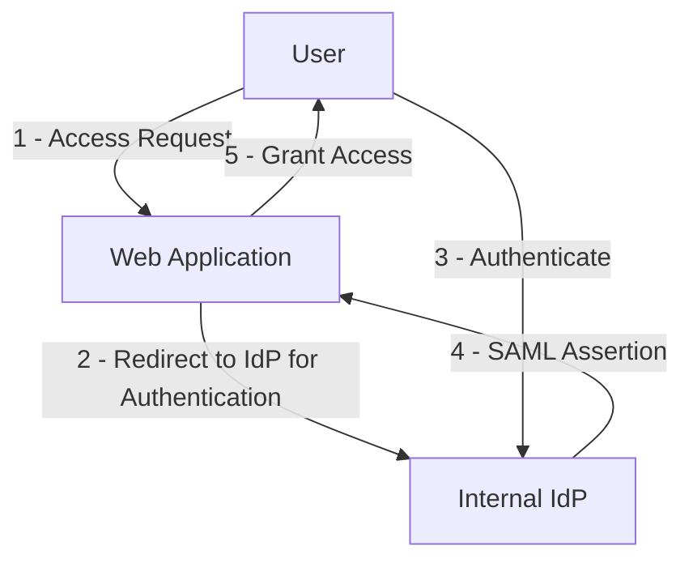
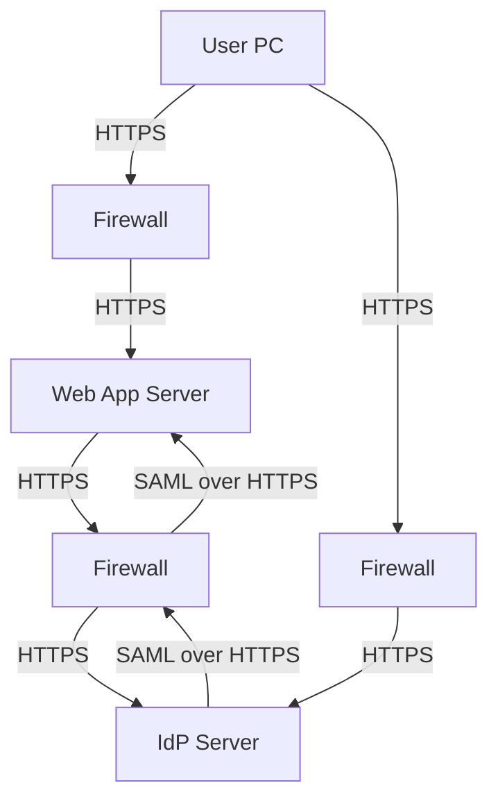
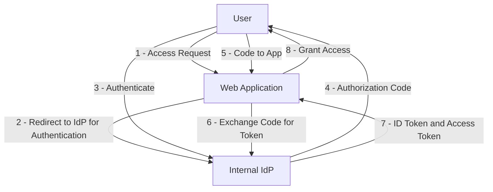
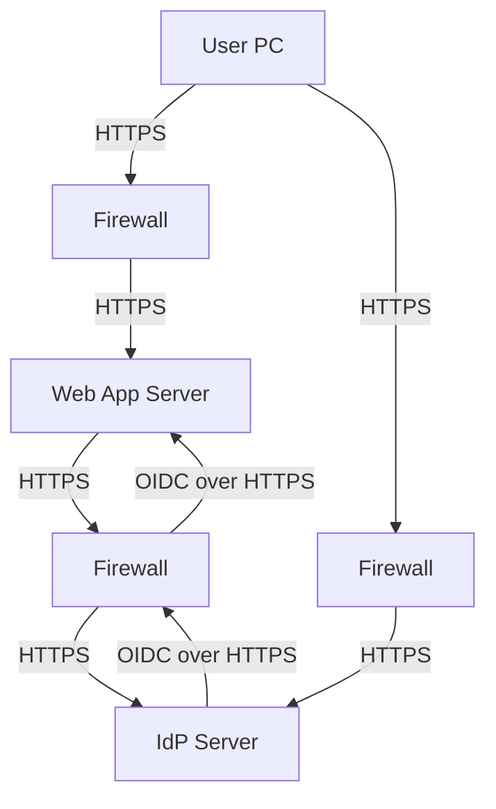
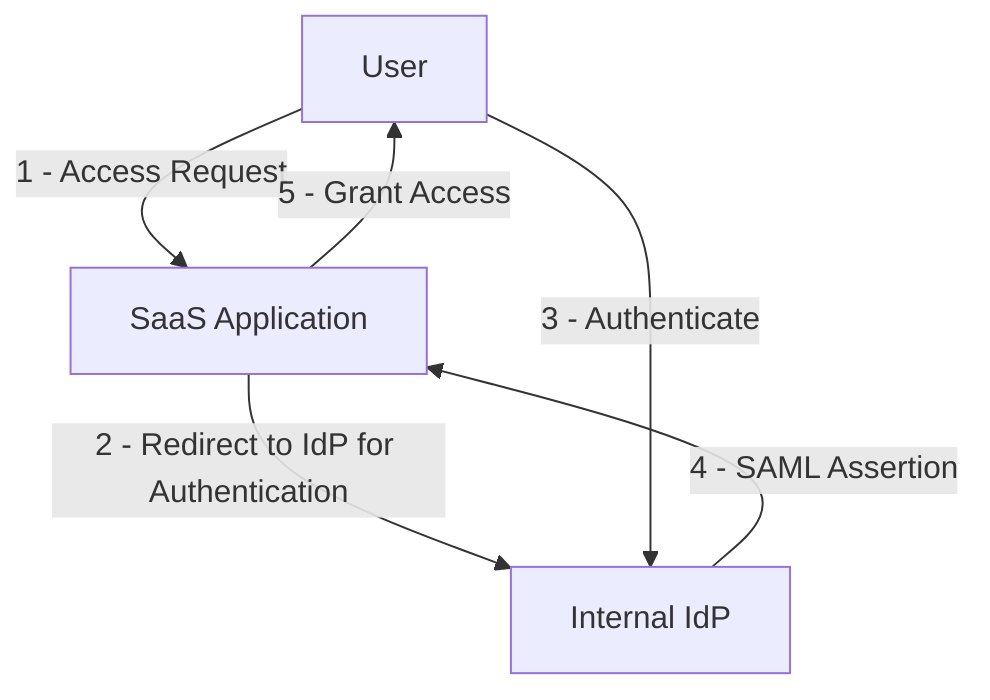
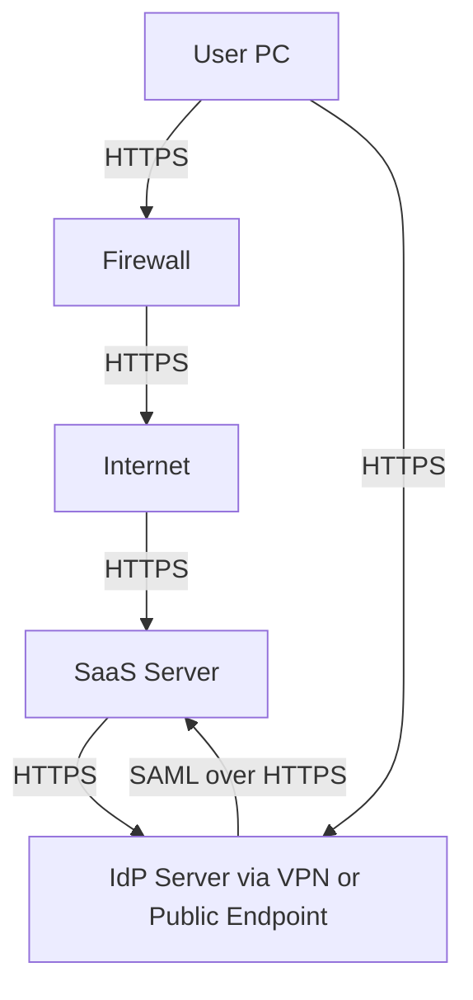
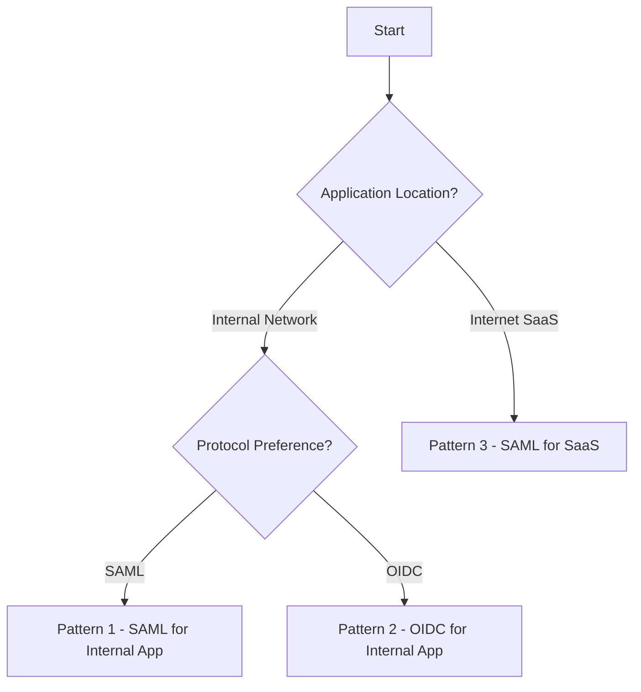
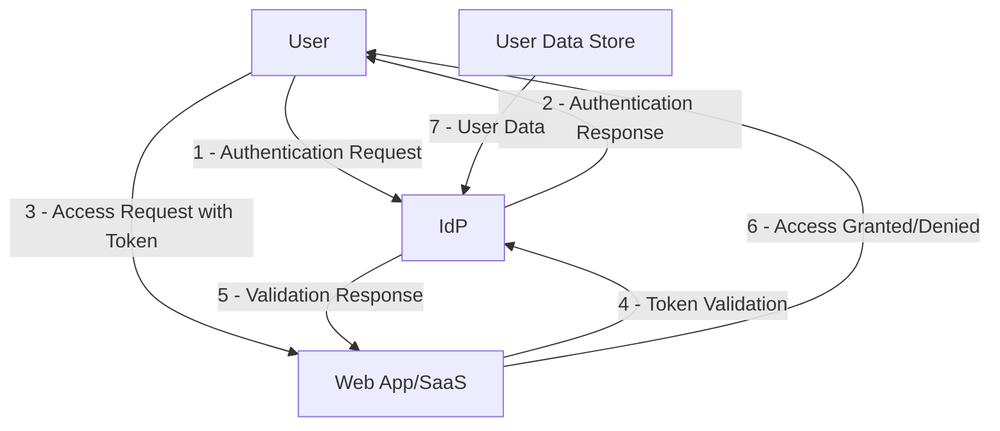

# SSO Pattern with IdP

## Purpose
The purpose of this document is to outline the Single Sign-On (SSO) pattern using an Identity Provider (IdP) to enable seamless authentication and authorization across multiple applications. This pattern aims to enhance user experience by reducing the need for multiple logins, improve security by centralizing authentication, and simplify administration of user access within an organization.

## Scope
This document covers the design and implementation of SSO for internal users accessing web applications within an internal network or Software as a Service (SaaS) applications on the Internet using an internal IdP. It includes specific patterns for authentication and authorization via Security Assertion Markup Language (SAML) and OpenID Connect (OIDC) protocols. The scope is limited to enterprise environments where an internal IdP is managed by the organization.

## Use Case
1. **Internal User SSO with SAML for Internal Web Application**: An internal user authenticates and authorizes access to a web application within the internal network using an internal IdP through SAML.
2. **Internal User SSO with OIDC for Internal Web Application**: An internal user authenticates and authorizes access to a web application within the internal network using an internal IdP through OIDC.
3. **Internal User SSO with SAML for Internet SaaS**: An internal user authenticates and authorizes access to a SaaS application on the Internet using an internal IdP through SAML.

## Patterns

### Pattern 1: Internal User SSO Authenticate and Authorize a Web Application within Internal Network Using Internal IdP through SAML
#### Logical Diagram

**Description**: The user attempts to access a web application, which redirects them to the internal IdP. After successful authentication, the IdP sends a SAML assertion to the application, granting access to the user.

#### Physical Diagram

**Description**: The user's PC communicates through a firewall to reach the web application server within the trusted internal zone, which then communicates through another firewall to the IdP server for authentication due to micro-segmentation. SAML assertions are exchanged securely over HTTPS through the firewalls. Firewalls exist between the user and web application, and between the web application and IdP to enforce security boundaries within the internal network.

#### Firewall Rule
- **User to Web App Rule**: Allow HTTPS (port 443) traffic from User PC through Firewall to Web App Server.
- **Web App to IdP Rule**: Allow HTTPS (port 443) traffic from Web App Server through Firewall to IdP Server for SAML assertion exchange.
- **User to IdP Rule**: Allow HTTPS (port 443) traffic from User PC through Firewall to IdP Server for direct authentication.
- **Purpose**: Enforces micro-segmentation within the internal network to enhance security by controlling traffic between different segments, even within the trusted zone.

#### Onboarding Information
Web applications need to provide the following to the IdP for integration:
- **Entity ID**: Unique identifier for the Service Provider (SP), typically the application URL.
- **Assertion Consumer Service (ACS) URL**: Endpoint where SAML assertions are sent post-authentication.
- **Required Attributes**: List of user attributes (e.g., email, role) needed for authorization.
- **Certificate**: Public key certificate for encrypting SAML responses (if encryption is used).
- **Metadata URL**: URL providing SP metadata for IdP configuration.

### Pattern 2: Internal User SSO Authenticate and Authorize a Web Application within Internal Network Using Internal IdP through OIDC
#### Logical Diagram

**Description**: The user accesses a web application, which redirects to the IdP. After authentication, an authorization code is returned to the user, forwarded to the app, and exchanged for ID and access tokens via OIDC, granting access.

#### Physical Diagram

**Description**: Similar to SAML, the user's PC communicates through a firewall to reach the web application server within the trusted internal zone, which then communicates through another firewall to the IdP server for authentication due to micro-segmentation. OIDC token exchange occurs securely over HTTPS through the firewalls. Firewalls exist between the user and web application, and between the web application and IdP to enforce security boundaries within the internal network.

#### Firewall Rule
- **User to Web App Rule**: Allow HTTPS (port 443) traffic from User PC through Firewall to Web App Server.
- **Web App to IdP Rule**: Allow HTTPS (port 443) traffic from Web App Server through Firewall to IdP Server for token exchange.
- **User to IdP Rule**: Allow HTTPS (port 443) traffic from User PC through Firewall to IdP Server for direct authentication.
- **Purpose**: Enforces micro-segmentation within the internal network to enhance security by controlling traffic between different segments, even within the trusted zone.

#### Onboarding Information
- **Client ID**: Unique identifier for the application registered with the IdP.
- **Client Secret**: Secret key for secure token exchange (stored securely by the app).
- **Redirect URI**: Endpoint where authorization codes are sent post-authentication.
- **Scopes**: Permissions requested (e.g., openid, profile, email).
- **Metadata URL**: URL for OIDC discovery document if available.

### Pattern 3: Internal User SSO Authenticate and Authorize a SaaS on Internet Using Internal IdP through SAML
#### Logical Diagram

**Description**: The user attempts to access a SaaS application, which redirects to the internal IdP. Post-authentication, a SAML assertion is sent to the SaaS, granting access.

#### Physical Diagram

**Description**: User traffic goes through the firewall to the Internet, crossing from the trusted internal zone to the untrusted Internet zone, reaching the SaaS server. The SaaS server communicates with the internal IdP (via VPN or public endpoint) for SAML-based authentication. The firewall marks the boundary between trusted and untrusted zones.

#### Firewall Rule
- **Inbound Rule**: Allow HTTPS (port 443) traffic from User PC through Firewall to Internet for SaaS access and direct to IdP Server within internal zone.
- **Outbound Rule**: Allow HTTPS (port 443) traffic through Firewall to SaaS Server and from SaaS Server to IdP Server (if public endpoint used).
- **VPN Consideration**: If IdP is not publicly accessible, ensure VPN tunnel allows SaaS to IdP communication through the firewall.
- **Purpose**: Facilitates secure access to external SaaS by enforcing security at the boundary between trusted internal and untrusted Internet zones while protecting internal IdP communications.

#### Onboarding Information
- **Entity ID**: Unique identifier for the SaaS SP.
- **Assertion Consumer Service (ACS) URL**: SaaS endpoint for receiving SAML assertions.
- **Required Attributes**: User attributes needed by SaaS for authorization.
- **Certificate**: Public key for encryption if required by SaaS.
- **Metadata URL**: SaaS metadata URL for IdP configuration.

### Controls
List of controls that web application or SaaS must implement, with validation party and process:
- **Secure Token Storage**: Web app/SaaS must store tokens (SAML assertions or OIDC tokens) securely (e.g., HttpOnly cookies). Validated by Cybersecurity team during security review.
- **Token Validation**: Web app/SaaS must validate token signatures and expiration before granting access. Validated by Cybersecurity team via penetration testing.
- **TLS Enforcement**: All communications must use TLS 1.2 or above. Validated by Network team during setup and periodic scans.
- **User Session Management**: Web app/SaaS must invalidate sessions on logout or token expiry. Validated by IdP team through test logins.
- **Attribute Mapping**: Ensure correct mapping of IdP attributes to app roles/permissions. Validated by App team during integration testing.
- **Error Handling**: Web app/SaaS must handle authentication errors gracefully without exposing sensitive information. Validated by Cybersecurity team during security reviews.
- **IdP Availability Check**: Web app/SaaS should have fallback mechanisms or error messages for IdP downtime. Validated by App team in disaster recovery drills.

### Decision Tree to Choose a Pattern

**Description**: Choose Pattern 1 for internal apps using SAML due to enterprise compatibility. Opt for Pattern 2 with OIDC for modern internal apps supporting token-based auth. Use Pattern 3 for SaaS on the Internet, typically supporting SAML for enterprise integration.

## Tools Used in the Design
- **IdP Solutions**: Okta, Ping Identity, Microsoft Azure AD for SAML and OIDC support.
- **SAML Libraries**: SimpleSAMLphp, Spring Security SAML for app integration.
- **OIDC Libraries**: Keycloak, Auth0 client libraries for OIDC flows.
- **Monitoring Tools**: Splunk, ELK Stack for logging authentication events.
- **Testing Tools**: OWASP ZAP, Burp Suite for security testing of SSO integrations.
- **Diagram Tools**: Mermaid.js for creating logical and physical diagrams as shown above.

### Key Assumptions
1. **Cybersecurity Validation**: Cybersecurity validates web applications' controls during security reviews by tests such as penetration testing.
2. **Responsibility Segregation**: Web application teams implement controls for web applications only, while IdP teams handle IdP-specific controls.
3. **Network Access**: Users' PCs have network access to the IdP, with data in transit protected by TLS 1.2 or above using private CA-signed certificates.
4. **Application Access**: Users' PCs have network access to the web application or SaaS endpoints.
5. **Enterprise Environment**: Assumes an enterprise setup with managed IdP and controlled network environments.

### Threat Modeling
#### Data Flow Diagram

**Description**: The user initiates authentication with IdP, receives a response, and uses it to access the app. The app validates tokens with IdP before granting access. User data is sourced from a secure data store.

#### Threat Analysis with STRIDE
| **Category**      | **Threat**                                                                 | **Mitigation (Control)**                                                                                     | **Implementing Party** | **Residual Risk**       |
|-------------------|---------------------------------------------------------------------------|-------------------------------------------------------------------------------------------------------------|-------------------------|-------------------------|
| **Spoofing**      | Attacker impersonates user to IdP.                                       | - Multi-Factor Authentication (MFA) enforced by IdP requiring at least two forms of verification (e.g., password and hardware token). - Implement strong password policies with complexity requirements and regular rotation. - Use behavioral analytics to detect anomalous login attempts (e.g., unusual location or time). | IdP Team                | Low (if MFA bypassed via social engineering or stolen credentials) |
| **Spoofing**      | Attacker impersonates IdP to trick user or app.                          | - Use certificate-based mutual authentication between IdP and SPs. - Educate users to recognize phishing attempts and verify IdP URLs. - Implement strict domain validation in app to only trust specific IdP endpoints. | IdP & App Team          | Low (if user education fails or certificate compromise occurs) |
| **Tampering**     | Attacker modifies SAML/OIDC tokens in transit.                           | - Use TLS 1.2+ with strong cipher suites for all communications to prevent man-in-the-middle attacks. - Digitally sign tokens with strong cryptographic algorithms (e.g., RSA-2048 or ECDSA). - Implement token integrity checks at the app level to reject altered tokens. | Network & IdP Team      | None (assuming TLS and signing are properly implemented) |
| **Tampering**     | Attacker alters user attributes in token to gain higher privileges.      | - IdP must sign and optionally encrypt sensitive attributes in tokens. - Apps must validate attribute values against expected roles/permissions and reject unexpected data. - Use checksums or hashes for attribute integrity where encryption isn't feasible. | IdP & App Team          | Low (if app validation logic is flawed) |
| **Repudiation**   | User denies action after access granted.                                 | - Implement comprehensive logging of authentication events at IdP, including timestamps, IP addresses, and user actions. - Log access and critical actions at app level with correlation IDs linking to IdP logs. - Use secure, tamper-proof log storage with access controls to prevent log manipulation. | IdP & App Team          | None (with proper logging and storage) |
| **Repudiation**   | Attacker claims actions were performed by legitimate user.               | - Enforce non-repudiation through digital signatures on user actions where feasible. - Maintain detailed audit trails with immutable logging solutions (e.g., blockchain-based logs for critical transactions). - Correlate user session data across IdP and app for forensic analysis. | IdP & App Team          | Low (if logs are compromised before analysis) |
| **Information Disclosure** | Attacker intercepts sensitive data (tokens, user info) in transit. | - Encrypt tokens using strong algorithms (e.g., AES-256 for JWT payloads if needed). - Use secure channels (TLS 1.2+) for all data transmission. - Limit attribute disclosure to only necessary data via IdP attribute release policies. - Implement secure redirect mechanisms to prevent token leakage via referrer headers. | IdP & App Team          | None (with proper encryption and TLS) |
| **Information Disclosure** | Attacker accesses tokens or data via compromised app endpoint.    | - Store tokens securely in apps using HttpOnly, Secure, and SameSite cookies or secure storage mechanisms. - Implement Content Security Policy (CSP) to prevent cross-site scripting (XSS) attacks that could steal tokens. - Regularly audit app endpoints for vulnerabilities using static and dynamic analysis tools. | App Team                | Low (if app has unpatched vulnerabilities) |
| **Denial of Service** | Attacker floods IdP to prevent legitimate access.                    | - Implement rate limiting at IdP to restrict excessive requests per IP or user. - Deploy DDoS protection services (e.g., Cloudflare, Akamai) at network edges. - Use load balancing and redundancy for IdP servers to handle high traffic. - Design apps with graceful degradation or cached authentication for temporary IdP unavailability. | IdP & Network Team      | Medium (if attack scale exceeds defenses or caching fails) |
| **Denial of Service** | Attacker targets app post-authentication to disrupt service.         | - Implement app-level rate limiting and request throttling. - Use Web Application Firewalls (WAF) to filter malicious traffic. - Design apps with horizontal scaling to absorb traffic spikes. - Monitor app performance for early detection of DoS patterns. | App & Network Team      | Medium (if scaling limits are reached or WAF bypassed) |
| **Elevation of Privilege** | Attacker gains unauthorized access via stolen token.            | - Use short token lifetimes (e.g., 5-15 minutes for access tokens) with automatic refresh mechanisms. - Store tokens securely using HttpOnly, Secure cookies to prevent client-side access. - Implement immediate session invalidation on logout or suspicious activity detection. - Use token binding to tie tokens to specific client sessions or devices. | App Team                | Low (if token stolen before expiry and binding not enforced) |
| **Elevation of Privilege** | Attacker exploits misconfigured attribute mapping for higher access. | - IdP must enforce strict attribute release policies, only sending verified data. - Apps must implement role-based access control (RBAC) to validate and restrict permissions based on received attributes. - Regularly audit attribute mappings and permission sets for least privilege adherence. - Log and alert on unexpected privilege escalations for immediate investigation. | IdP & App Team          | Low (if misconfiguration overlooked during audits) |

**Residual Risk Evaluation**: Residual risks are evaluated as low to medium based on the likelihood and impact of bypassing implemented controls. For Spoofing, risks remain low but non-zero due to potential social engineering or credential theft bypassing MFA. Tampering risks are effectively mitigated with proper TLS and token signing, leaving no residual risk under standard conditions. Repudiation risks are negligible with robust logging, though log compromise could introduce minor risk. Information Disclosure risks are minimized with encryption and secure practices, but app vulnerabilities could still pose low risk if unpatched. Denial of Service remains a medium risk due to the potential scale of attacks overwhelming defenses, suggesting investment in advanced cloud-based DDoS mitigation services and enhanced caching strategies for critical services. Elevation of Privilege risks are low but persist if tokens are stolen within their validity period or if attribute mappings are misconfigured, necessitating continuous monitoring and periodic security audits to maintain security posture.
