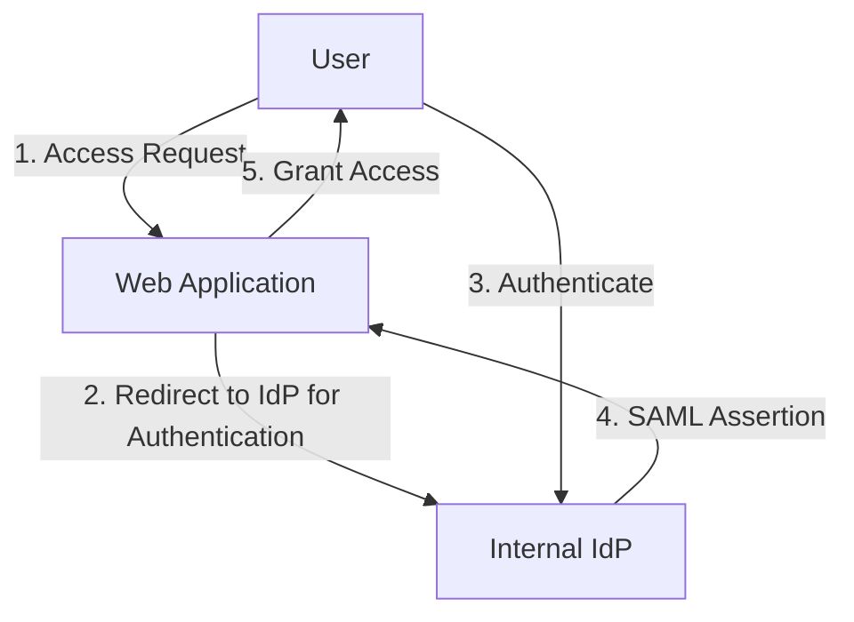
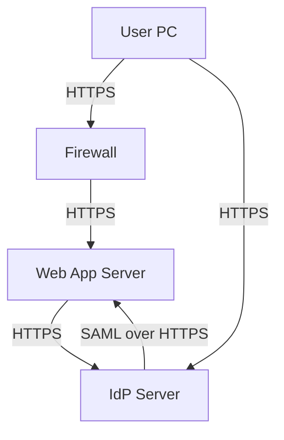
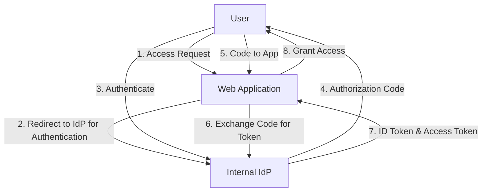
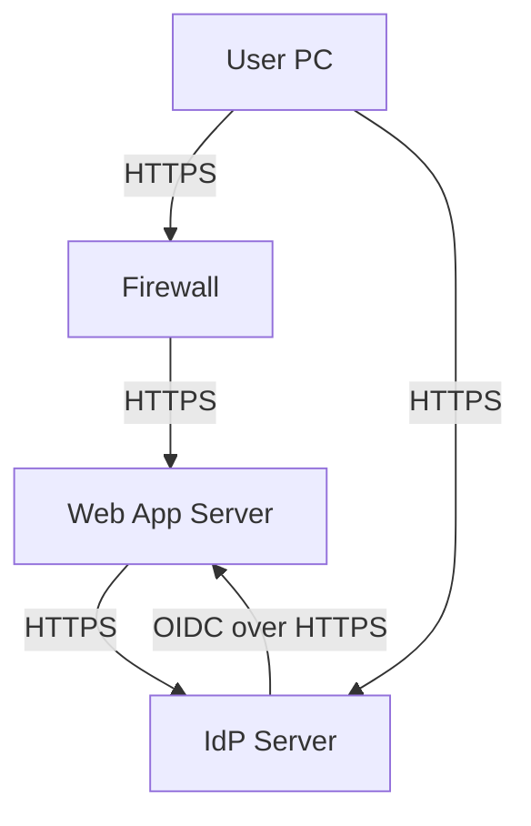
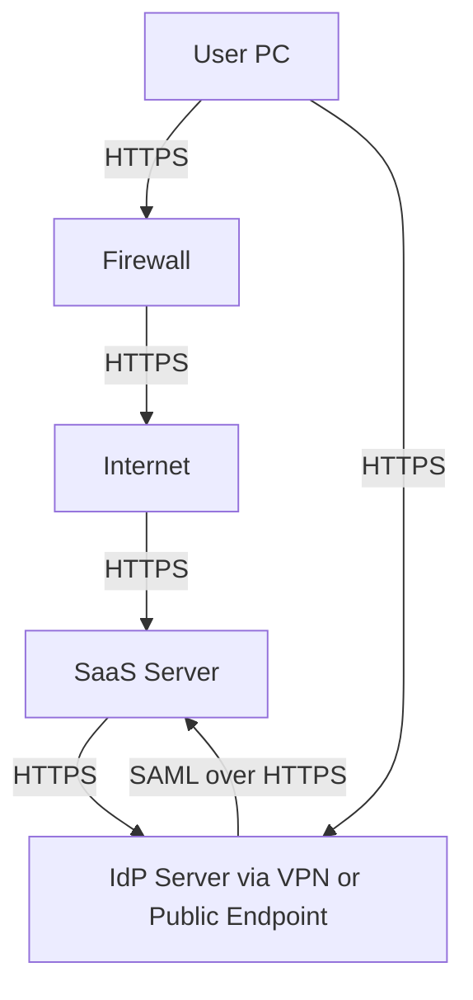
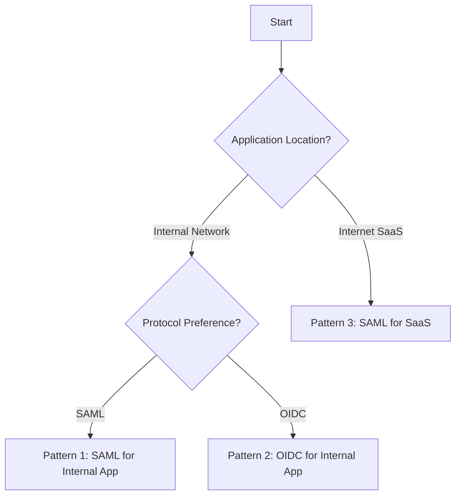
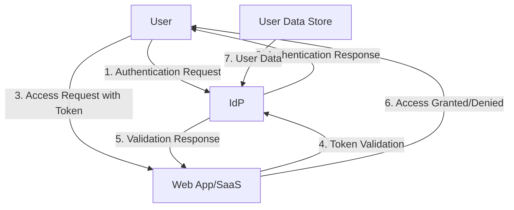

# SSO Pattern with IdP

## Purpose
The purpose of this document is to outline the Single Sign-On (SSO) pattern using an Identity Provider (IdP) to enable seamless authentication and authorization across multiple applications. This pattern aims to enhance user experience by reducing the need for multiple logins, improve security by centralizing authentication, and simplify administration of user access within an organization.

## Scope
This document covers the design and implementation of SSO for internal users accessing web applications within an internal network or Software as a Service (SaaS) applications on the Internet using an internal IdP. It includes specific patterns for authentication and authorization via Security Assertion Markup Language (SAML) and OpenID Connect (OIDC) protocols. The scope is limited to enterprise environments where an internal IdP is managed by the organization.

## Use Case
1. **Internal User SSO with SAML for Internal Web Application**: An internal user authenticates and authorizes access to a web application within the internal network using an internal IdP through SAML.
2. **Internal User SSO with OIDC for Internal Web Application**: An internal user authenticates and authorizes access to a web application within the internal network using an internal IdP through OIDC.
3. **Internal User SSO with SAML for Internet SaaS**: An internal user authenticates and authorizes access to a SaaS application on the Internet using an internal IdP through SAML.

## Patterns

### Pattern 1: Internal User SSO Authenticate and Authorize a Web Application within Internal Network Using Internal IdP through SAML
#### Logical Diagram

**Description**: The user attempts to access a web application, which redirects them to the internal IdP. After successful authentication, the IdP sends a SAML assertion to the application, granting access to the user.

#### Physical Diagram

**Description**: The user's PC communicates through a firewall to reach the web application server, which redirects to the IdP server for authentication. SAML assertions are exchanged securely over HTTPS.

#### Firewall Rule
- **Inbound Rule**: Allow HTTPS (port 443) traffic from User PC to Web App Server and IdP Server.
- **Outbound Rule**: Allow HTTPS (port 443) traffic from Web App Server to IdP Server for SAML assertion exchange.
- **Purpose**: Ensures secure communication channels for authentication requests and responses while restricting unauthorized access.

#### Onboarding Information
Web applications need to provide the following to the IdP for integration:
- **Entity ID**: Unique identifier for the Service Provider (SP), typically the application URL.
- **Assertion Consumer Service (ACS) URL**: Endpoint where SAML assertions are sent post-authentication.
- **Required Attributes**: List of user attributes (e.g., email, role) needed for authorization.
- **Certificate**: Public key certificate for encrypting SAML responses (if encryption is used).
- **Metadata URL**: URL providing SP metadata for IdP configuration.

### Pattern 2: Internal User SSO Authenticate and Authorize a Web Application within Internal Network Using Internal IdP through OIDC
#### Logical Diagram

**Description**: The user accesses a web application, which redirects to the IdP. After authentication, an authorization code is returned to the user, forwarded to the app, and exchanged for ID and access tokens via OIDC, granting access.

#### Physical Diagram

**Description**: Similar to SAML, but using OIDC protocol for token exchange over HTTPS through the firewall.

#### Firewall Rule
- **Inbound Rule**: Allow HTTPS (port 443) traffic from User PC to Web App Server and IdP Server.
- **Outbound Rule**: Allow HTTPS (port 443) traffic from Web App Server to IdP Server for token exchange.
- **Purpose**: Secures communication for OIDC authentication flows.

#### Onboarding Information
- **Client ID**: Unique identifier for the application registered with the IdP.
- **Client Secret**: Secret key for secure token exchange (stored securely by the app).
- **Redirect URI**: Endpoint where authorization codes are sent post-authentication.
- **Scopes**: Permissions requested (e.g., openid, profile, email).
- **Metadata URL**: URL for OIDC discovery document if available.

### Pattern 3: Internal User SSO Authenticate and Authorize a SaaS on Internet Using Internal IdP through SAML
#### Logical Diagram

**Description**: The user attempts to access a SaaS application, which redirects to the internal IdP. Post-authentication, a SAML assertion is sent to the SaaS, granting access.

#### Physical Diagram

**Description**: User traffic goes through the firewall to the Internet, reaching the SaaS server, which communicates with the internal IdP (via VPN or public endpoint) for SAML-based authentication.

#### Firewall Rule
- **Inbound Rule**: Allow HTTPS (port 443) traffic from User PC to Internet and IdP Server.
- **Outbound Rule**: Allow HTTPS (port 443) traffic to SaaS Server and from SaaS Server to IdP Server (if public endpoint used).
- **VPN Consideration**: If IdP is not publicly accessible, ensure VPN tunnel allows SaaS to IdP communication.
- **Purpose**: Facilitates secure access to external SaaS while protecting internal IdP communications.

#### Onboarding Information
- **Entity ID**: Unique identifier for the SaaS SP.
- **Assertion Consumer Service (ACS) URL**: SaaS endpoint for receiving SAML assertions.
- **Required Attributes**: User attributes needed by SaaS for authorization.
- **Certificate**: Public key for encryption if required by SaaS.
- **Metadata URL**: SaaS metadata URL for IdP configuration.

### Controls
List of controls that web application or SaaS must implement, with validation party and process:
- **Secure Token Storage**: Web app/SaaS must store tokens (SAML assertions or OIDC tokens) securely (e.g., HttpOnly cookies). Validated by Cybersecurity team during security review.
- **Token Validation**: Web app/SaaS must validate token signatures and expiration before granting access. Validated by Cybersecurity team via penetration testing.
- **TLS Enforcement**: All communications must use TLS 1.2 or above. Validated by Network team during setup and periodic scans.
- **User Session Management**: Web app/SaaS must invalidate sessions on logout or token expiry. Validated by IdP team through test logins.
- **Attribute Mapping**: Ensure correct mapping of IdP attributes to app roles/permissions. Validated by App team during integration testing.
- **Error Handling**: Web app/SaaS must handle authentication errors gracefully without exposing sensitive information. Validated by Cybersecurity team during security reviews.
- **IdP Availability Check**: Web app/SaaS should have fallback mechanisms or error messages for IdP downtime. Validated by App team in disaster recovery drills.

### Decision Tree to Choose a Pattern

**Description**: Choose Pattern 1 for internal apps using SAML due to enterprise compatibility. Opt for Pattern 2 with OIDC for modern internal apps supporting token-based auth. Use Pattern 3 for SaaS on the Internet, typically supporting SAML for enterprise integration.

## Tools Used in the Design
- **IdP Solutions**: Okta, Ping Identity, Microsoft Azure AD for SAML and OIDC support.
- **SAML Libraries**: SimpleSAMLphp, Spring Security SAML for app integration.
- **OIDC Libraries**: Keycloak, Auth0 client libraries for OIDC flows.
- **Monitoring Tools**: Splunk, ELK Stack for logging authentication events.
- **Testing Tools**: OWASP ZAP, Burp Suite for security testing of SSO integrations.
- **Diagram Tools**: Mermaid.js for creating logical and physical diagrams as shown above.

### Key Assumptions
1. **Cybersecurity Validation**: Cybersecurity validates web applications' controls during security reviews by tests such as penetration testing.
2. **Responsibility Segregation**: Web application teams implement controls for web applications only, while IdP teams handle IdP-specific controls.
3. **Network Access**: Users' PCs have network access to the IdP, with data in transit protected by TLS 1.2 or above using private CA-signed certificates.
4. **Application Access**: Users' PCs have network access to the web application or SaaS endpoints.
5. **Enterprise Environment**: Assumes an enterprise setup with managed IdP and controlled network environments.

### Threat Modeling
#### Data Flow Diagram

**Description**: The user initiates authentication with IdP, receives a response, and uses it to access the app. The app validates tokens with IdP before granting access. User data is sourced from a secure data store.

#### Threat Analysis with STRIDE
| **Category**      | **Threat**                                                                 | **Mitigation (Control)**                                                                                     | **Implementing Party** | **Residual Risk**       |
|-------------------|---------------------------------------------------------------------------|-------------------------------------------------------------------------------------------------------------|-------------------------|-------------------------|
| **Spoofing**      | Attacker impersonates user to IdP.                                       | Multi-Factor Authentication (MFA) enforced by IdP.                                                          | IdP Team                | Low (if MFA bypassed)   |
| **Tampering**     | Attacker modifies SAML/OIDC tokens in transit.                           | Use TLS 1.2+ for all communications; sign tokens with strong cryptography.                                 | Network & IdP Team      | None                    |
| **Repudiation**   | User denies action after access granted.                                 | Comprehensive logging of authentication events at IdP and app level.                                       | IdP & App Team          | None                    |
| **Information Disclosure** | Attacker intercepts sensitive data (tokens, user info).          | Encrypt tokens; use secure channels (TLS); limit attribute disclosure to necessary data only.              | IdP & App Team          | None                    |
| **Denial of Service** | Attacker floods IdP to prevent legitimate access.                    | Implement rate limiting, DDoS protection at IdP and network level.                                         | IdP & Network Team      | Medium (if attack scale exceeds defenses) |
| **Elevation of Privilege** | Attacker gains unauthorized access via stolen token.            | Short token lifetimes; secure token storage (HttpOnly cookies); immediate session invalidation on logout.  | App Team                | Low (if token stolen before expiry) |

**Residual Risk Evaluation**: Residual risks are evaluated as low to medium based on the likelihood and impact of bypassing controls. For Denial of Service, consider additional cloud-based DDoS mitigation services if risk level increases.
